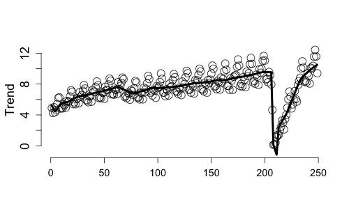
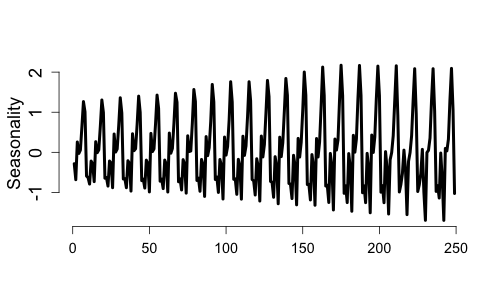
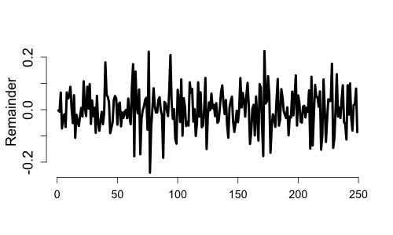

# BASTION: Bayesian Adaptive Seasonality and Trend Decomposition Incorporating Outliers and Noise

**BASTION** is an R package providing a Bayesian framework for decomposing univariate time series into meaningful components. It offers several key advantages over existing decomposition methods:

- **Locally adaptive** estimation of trend and seasonality.
- Explicit modeling of **outliers** and **time-varying volatility**.
- Robust **uncertainty quantification** through credible intervals for all components.

---

## Installation
```r
# Install devtools package if not already installed
install.packages("devtools")
devtools::install_github("Jasoncho0914/BASTION")
```
---

## Quick Start

The main function is ```fit_BASTION ```. Following is a quick demonstration using the Airline Passenger data between 1949 to 1960.
```r
data(airtraffic)
fit <- fit_BASTION(y = airtraffic$Int_Pax,
                   Ks = list(12))
#Trend
plot(fit$summary$p_means$y,ylim = c(-1,13),ylab = "Trend")
lines(fit$summary$p_means$Trend,lwd = 4)

#Yearly Seasonality
plot(fit$summary$p_means$Seasonal12,type= "l",lwd = 4,ylab = "Seasonality (k=12)")

#Remainder
plot(fit$summary$p_means$Remainder,type = "l",lwd = 4,ylab = "Remainder")
```
<p align="center">
  
  
  
</p>

---

## Learn More

- **Overview**: Key features and practical applications of BASTION are summarized in the [Non-Technical Guide](https://jasoncho0914.github.io/BASTION/articles/non-technical_guide.html).  
- **Preprint**: For an in-depth discussion, see the accompanying paper:  
  [link](paper/BASTION_20250124.pdf).


---

## Citation
```bibtex
@Manual{BASTION,
  title        = {BASTION: Bayesian Adaptive Seasonality and Trend Decomposition Incorporating Outliers and Noise},
  author       = {Jason B. Cho},
  year         = {2025},
  url          = {https://github.com/Jasoncho0914/BASTION}
}
```
